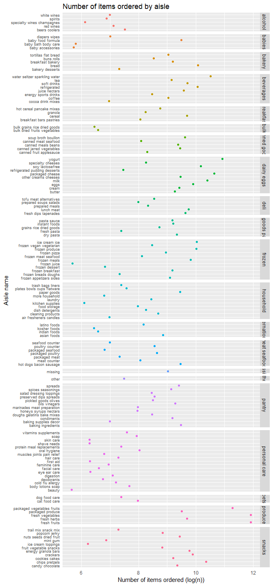
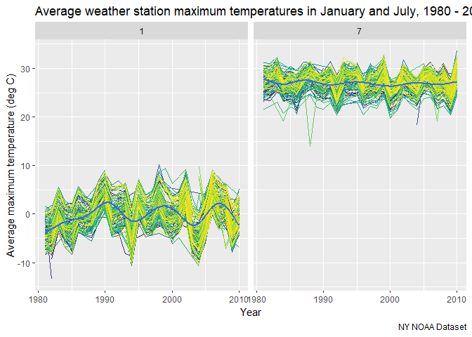
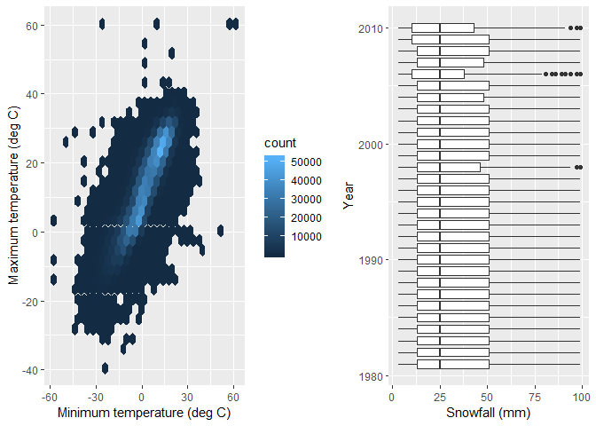

P8103 Homework 3
================
Adina Zhang

Problem 1
---------

#### Set up BRFSS dataset

``` r
# Load and clean BRFSS dataset
brfss_df = brfss_smart2010 %>% 
  janitor::clean_names() %>% 
  filter(topic == "Overall Health") %>% 
  select(year, locationabbr, locationdesc, response, data_value) %>% 
  mutate(response = factor(response,
                           levels = c("Excellent", "Very good", "Good", "Fair", "Poor"))) 

brfss_df
```

    ## # A tibble: 10,625 x 5
    ##     year locationabbr locationdesc          response  data_value
    ##    <int> <chr>        <chr>                 <fct>          <dbl>
    ##  1  2010 AL           AL - Jefferson County Excellent       18.9
    ##  2  2010 AL           AL - Jefferson County Very good       30  
    ##  3  2010 AL           AL - Jefferson County Good            33.1
    ##  4  2010 AL           AL - Jefferson County Fair            12.5
    ##  5  2010 AL           AL - Jefferson County Poor             5.5
    ##  6  2010 AL           AL - Mobile County    Excellent       15.6
    ##  7  2010 AL           AL - Mobile County    Very good       31.3
    ##  8  2010 AL           AL - Mobile County    Good            31.2
    ##  9  2010 AL           AL - Mobile County    Fair            15.5
    ## 10  2010 AL           AL - Mobile County    Poor             6.4
    ## # ... with 10,615 more rows

The BRFSS dataset contains health-related data from surveys of selected counties within the United States. In this problem, we are primarily focusing on how individuals reported their "Overall Health" from 2002 to 2010. This dataset contains 10625 observations and 5 variables. Key variables include state and county locations, year the observations were taken, responses to the question of overall health (ie. excellent, fair, poor) and proportions of these responses.

#### Subset the dataset into number of locations per state in 2002

We are interested in counting how many locations (counties) were surveyed in each state.

``` r
# Subset brfss dataset by survey locations
# Count number of responses
filter(brfss_df, year == 2002) %>% 
  distinct(locationabbr, locationdesc) %>% 
  group_by(locationabbr) %>% 
  count() %>% 
  filter(n == 7) %>% 
  knitr::kable()
```

| locationabbr |    n|
|:-------------|----:|
| CT           |    7|
| FL           |    7|
| NC           |    7|

In 2002, there were three states (CT, FL, and NC) that obtained survey answers from seven locations.

#### Spaghetti plot

``` r
# Separate dataset into spaghetti plot variables
spaghetti_plot = brfss_df %>% 
  distinct(locationabbr, locationdesc, year) %>% 
  group_by(locationabbr, year) %>% 
  summarize(n = n())

# Create spaghetti_plot 
spaghetti_plot %>% 
  ggplot(aes(x = year, y = n)) +
  geom_line(aes(color = locationabbr)) +
  viridis::scale_color_viridis(
    name = "Location", 
    discrete = TRUE
  ) + 
  labs(
    title = "Number of locations by state, 2002-2010",
    x = "Year",
    y = "Number of Locations",
    caption = "BRFSS Dataset"
  ) + 
  theme(legend.position = "bottom", legend.box = "horizontal")
```


Most states were surveyed at 10 or fewer locations. A couple states had been surveyed between 10 and 20 locations. There were two extreme cases where two states were surveyed at 40+ locations in 2007 and 2010.

#### Descriptive variables "Excellent" proportions across New York State in 2002, 2006, and 2010

``` r
# Summarize descriptive variables to make a table
brfss_df %>% 
  filter(year %in% c(2002, 2006, 2010), 
         response == "Excellent", 
         locationabbr == "NY") %>% 
  group_by(year) %>% 
  summarize(mean_excellent = mean(data_value, na.rm = TRUE),
            std_excellent = sd(data_value, na.rm = TRUE)) %>% 
  knitr::kable()
```

|  year|  mean\_excellent|  std\_excellent|
|-----:|----------------:|---------------:|
|  2002|         24.04000|        4.486424|
|  2006|         22.53333|        4.000833|
|  2010|         22.70000|        3.567212|

Between 2002, 2006, and 2010 the average proportion of "excellent" responses does not differ by much. The highest average occured in 2002 with 24.04% responding they had excellent health and a standard deviation of 4.48%. Meanwhile, the lowest average occured in 2006 with 22.53% responding they had excellent health and a standard deviation of 4.00%.

#### Five-panel plot, distribution of responses

``` r
# Summarize average proportions of each response 
response_df = brfss_df %>% 
  group_by(year, locationabbr, response) %>% 
  summarize(mean_prop = mean(data_value, na.rm = TRUE))

# Plot distributions in five panels
response_df %>% 
  ggplot(aes(x = year, y = mean_prop, color = as.factor(year))) + 
  geom_boxplot(aes(group = year)) + 
  facet_grid(.~response) + 
  labs(
    title = "Distribution of response proportions by state-level, 2002-2010",
    x = "Year",
    y = "State level averages (%)",
    caption = "BRFSS dataset"
  ) + 
  viridis::scale_color_viridis(
    name = "Location", 
    discrete = TRUE
  ) + 
  theme(legend.position = "none",
        axis.text.x = element_text(angle = 60))
```


Overall, year to year we see that response proportions remain around the same percentage. The highest proportions of responses fall under "Very good", "Good", and "Excellent" categories. The lowest proportions of responses fall under "Fair" and "Poor" categories. There also appears to be slightly more variance in the "Poor" category with more outliers. Based off of this figure, we might be able to conclude that between 2002 and 2010, Americans generally felt at least good or even better of their overall health.

Problem 2
---------

#### Instacart summary

``` r
# Load instacard
instacart_df = instacart

instacart_df
```

    ## # A tibble: 1,384,617 x 15
    ##    order_id product_id add_to_cart_ord~ reordered user_id eval_set
    ##       <int>      <int>            <int>     <int>   <int> <chr>   
    ##  1        1      49302                1         1  112108 train   
    ##  2        1      11109                2         1  112108 train   
    ##  3        1      10246                3         0  112108 train   
    ##  4        1      49683                4         0  112108 train   
    ##  5        1      43633                5         1  112108 train   
    ##  6        1      13176                6         0  112108 train   
    ##  7        1      47209                7         0  112108 train   
    ##  8        1      22035                8         1  112108 train   
    ##  9       36      39612                1         0   79431 train   
    ## 10       36      19660                2         1   79431 train   
    ## # ... with 1,384,607 more rows, and 9 more variables: order_number <int>,
    ## #   order_dow <int>, order_hour_of_day <int>,
    ## #   days_since_prior_order <int>, product_name <chr>, aisle_id <int>,
    ## #   department_id <int>, aisle <chr>, department <chr>

Instacart is an online grocery shopping company, and the instacard dataset contains information on online grocery orders from their customers. The instacart dataset includes 1384617 observations and 15 variables. Some of these key variables include product name, food aisle information (name, number, department), time or order (day of the week, hour of the day, days since last ordered). For example, there are 21 departments which include snacks, frozen foods, and dairy and eggs. On average, most customers will make orders on 2.7013918 day, which according to the datasets key is between Tuesday or Wednesday. The most popular time to place orders is at 13.5775922 hours.

#### Aisle information

There are 134 aisles in this dataset. Some examples of these include yogurt, fresh vegetables, and specialty cheeses. The aisle with the most counts of order. Most items are ordered from the fresh vegetable, fresh fruit, and packaged vegetables and fruits aisles.

``` r
# Group by aisles and summarize counts
aisle_count = instacart_df %>% 
  group_by(aisle, department) %>% 
  summarize(n = n()) %>% 
  arrange(desc(n)) 
  
aisle_count
```

    ## # A tibble: 134 x 3
    ## # Groups:   aisle [134]
    ##    aisle                         department      n
    ##    <chr>                         <chr>       <int>
    ##  1 fresh vegetables              produce    150609
    ##  2 fresh fruits                  produce    150473
    ##  3 packaged vegetables fruits    produce     78493
    ##  4 yogurt                        dairy eggs  55240
    ##  5 packaged cheese               dairy eggs  41699
    ##  6 water seltzer sparkling water beverages   36617
    ##  7 milk                          dairy eggs  32644
    ##  8 chips pretzels                snacks      31269
    ##  9 soy lactosefree               dairy eggs  26240
    ## 10 bread                         bakery      23635
    ## # ... with 124 more rows

**Aisle Count Plot**

``` r
# Plot distribution of items ordered from each aisle
ggplot(aisle_count, aes(x = log(n), y = aisle)) +
  geom_point(aes(color = department)) + 
  facet_grid(rows = vars(department), scales = "free", space = "free") + 
  labs(
    title = "Number of items ordered by aisle",
    x = "Log(Number of items ordered)",
    y = "Aisle name"
  ) + 
  theme(axis.ticks = element_blank(), 
        legend.position = "none",
        axis.text.y = element_text(size = 7)) 
```



Based off of this figure, the most popular products fall under produce (fresh vegetables and fruits) as well as dairy (yogurt and packaged cheese). Some of the least bought products include baby accessories and baby bath/body care, beauty products, and frozen juice.

#### Popular aisle items

``` r
# Subset and group instacart_df to products of interest
# Count products and then rank them to see most popular purchases
instacart_df %>% 
  filter(aisle %in% c("baking ingredients", 
                      "dog food care", 
                      "packaged vegetables fruits")) %>% 
  group_by(aisle, product_name) %>% 
  summarize(n = n()) %>% 
  mutate(product_rank = min_rank(desc(n))) %>% 
  filter(product_rank == 1) %>% 
  knitr::kable()
```

| aisle                      | product\_name                                 |     n|  product\_rank|
|:---------------------------|:----------------------------------------------|-----:|--------------:|
| baking ingredients         | Light Brown Sugar                             |   499|              1|
| dog food care              | Snack Sticks Chicken & Rice Recipe Dog Treats |    30|              1|
| packaged vegetables fruits | Organic Baby Spinach                          |  9784|              1|

In the baking ingredient aisle, light brown sugar is the most commonly bought item with it being bought 499 times. Under dog food care, snack sticks chicken and rice recipe dog treats are the most popular item with 30 counts of purchase. Among packaged vegetables and fruits, organic baby spinach is the most popular with 9,784 counts of purchase.

#### Average time of day

``` r
# Subset instacart data to products of interest and times
# Summarize average hour of the day and spread dataset into table format
instacart_df %>% 
  filter(product_name %in% c("Pink Lady Apples", "Coffee Ice Cream")) %>% 
  select(product_name, order_hour_of_day, order_dow) %>% 
  group_by(order_dow, product_name) %>% 
  summarize(mean_hour = mean(order_hour_of_day, na.rm = TRUE)) %>% 
  spread(key = product_name, value = mean_hour) %>% 
  knitr::kable()
```

|  order\_dow|  Coffee Ice Cream|  Pink Lady Apples|
|-----------:|-----------------:|-----------------:|
|           0|          13.77419|          13.44118|
|           1|          14.31579|          11.36000|
|           2|          15.38095|          11.70213|
|           3|          15.31818|          14.25000|
|           4|          15.21739|          11.55172|
|           5|          12.26316|          12.78431|
|           6|          13.83333|          11.93750|

This table depicts the average time of day (Sunday through Saturday) customers ordered coffee ice cream and pink lady apples. Note that the week days begin with Sunday (0) and progress to Saturday (6). Based off of this table, people usual buy coffee ice cream in the afternoons with the earliest average time at 12.26 hours on Friday and the latest average time at 15.38 hours on Tuesday. People usually buy Pink Lady Apples at mid-day with the earliest average time at 11.36 hours on Monday and the latest average time at 14.25 hours on Wednesday.

Problem 3
---------

#### NY NOAA Summary

``` r
# Load NY NOAA Summary and clean
# Separate date into month, day, and year variables
# Divide tmax and tmin temperatures by 10 to change units to deg Celsius
# Change snowfall to centimeters
ny_noaa_df = ny_noaa %>% 
  separate(date, into = c("year", "month", "day"), sep = "-") %>% 
  mutate(year = as.numeric(year),
         month = as.numeric(month),
         day = as.numeric(day),
         snow = as.numeric(snow)/10,
         tmax = as.integer(tmax)/10,
         tmin = as.integer(tmin)/10)

ny_noaa_df
```

    ## # A tibble: 2,595,176 x 9
    ##    id           year month   day  prcp  snow  snwd  tmax  tmin
    ##    <chr>       <dbl> <dbl> <dbl> <int> <dbl> <int> <dbl> <dbl>
    ##  1 US1NYAB0001  2007    11     1    NA    NA    NA    NA    NA
    ##  2 US1NYAB0001  2007    11     2    NA    NA    NA    NA    NA
    ##  3 US1NYAB0001  2007    11     3    NA    NA    NA    NA    NA
    ##  4 US1NYAB0001  2007    11     4    NA    NA    NA    NA    NA
    ##  5 US1NYAB0001  2007    11     5    NA    NA    NA    NA    NA
    ##  6 US1NYAB0001  2007    11     6    NA    NA    NA    NA    NA
    ##  7 US1NYAB0001  2007    11     7    NA    NA    NA    NA    NA
    ##  8 US1NYAB0001  2007    11     8    NA    NA    NA    NA    NA
    ##  9 US1NYAB0001  2007    11     9    NA    NA    NA    NA    NA
    ## 10 US1NYAB0001  2007    11    10    NA    NA    NA    NA    NA
    ## # ... with 2,595,166 more rows

The NY NOAA dataset records weather and climate related information from the weather stations located in New York state, between 1980 to 2010. This dataset has 2595176 observations and 9 variables. Some key variables include weather station ID, date, precipitation amounts (precipitation, snowfall, snow depth), and temperatures (minimum and maximum). For example, the average snowfall in 2007 was 0.7436284 mm. That same year, the average minimum temperature recorded in thiswas 2.8787028 deg C. The average maximum temperature recorded in 2007 was NA deg C. It should be noted, that there are a significant amount of missing data in this dataset. For example, the following percentages are proportions of missing values for a couple of variables:
\* 5.62% of precipitation variables have missing values.
\* 43.71% of maximum temperature values have missing values.
\* 14.69% of snowfall measurements have missing values.

#### Maximum temperature

``` r
tmax_plot = ny_noaa_df %>%
  filter(month %in% c(1, 7), !(is.na(tmax))) %>% 
  mutate(month = factor(month, levels = c(1,7), labels = c("January", "July"))) %>% 
  group_by(id, year, month) %>% 
  summarize(mean_max_temp = mean(tmax, na.rm = TRUE))

tmax_plot %>% 
  ggplot(aes(x = year, y = mean_max_temp)) + 
  geom_line(aes(color = id)) + 
  geom_smooth(se = FALSE) + 
  facet_grid(.~month) + 
  theme(legend.position = "none") + 
  viridis::scale_color_viridis(
    name = "Location", 
    discrete = TRUE
  ) + 
  labs(
    title = "Average maximum temperatures by weather station, 1980 - 2010",
    x = "Year",
    y = "Average maximum temperature (deg C)",
    caption = "NY NOAA Dataset")
```



In January, the average maximum temperature was significantly lower than in July as one would expect. Over the years, the average maximum temperature in January fluctuates frequently. In comparison, July saw a pretty constant average maximum temperature over the years. There are perhaps a couple of unusual years, in January 1994 and 2004 there were some incredibly cold winters. In July, there is one weather station record that stands out as an outlier. Around 1997 or 1998, one weather station reported a very low average maximum temperature at around 14 deg C.

#### Two panel temperature and snowfall plots

``` r
# Create a hexplot to compare tmin and tmax
noaa_hexplot = ny_noaa_df %>% 
  ggplot(aes(x = tmin, y = tmax)) +
  geom_hex() + 
  labs(
    x = "Minimum temperature (deg C)",
    y = "Maximum temperature (deg C)"
  )

# Create a barplot of snowfall by year
noaa_barplot = ny_noaa_df %>% 
  filter(snow > 0 & snow < 100) %>% 
  group_by(year) %>% 
  ggplot(aes(x = year, y = snow, group = year)) + 
  geom_boxplot() + 
  coord_flip() + 
  labs(
    x = "Year",
    y = "Snowfall (cm)"
    )

noaa_hexplot + noaa_barplot
```

    ## Warning: Removed 1136276 rows containing non-finite values (stat_binhex).



From the maximum temperature vs. minimum temperature plot, a higher minimum temperature is correlated with a higher maximum temperature on the same day. Additionally, the most common temperatures correlated with each other is in the light blue area of the graph where minimum temperature ranges from approximated -15 deg C to 15 deg C and maximum temperature ranges from approximated -10 deg C to 30 deg C. Where the plot is dark colored, there are outliers. For example there was a day where minimum temperature was around 50 deg C and the maximum temperature was 0 deg C. This may resulted from data input error.

In the distribution of snowfall by year plot, there does not appear to be much difference or change in the amount of snowfall between 1980 to 2010. This plot does show that there is variance from year to year. Some years have extreme outliers. 2002 and 2008 are some examples of this, where there are several large values for snowfall.
