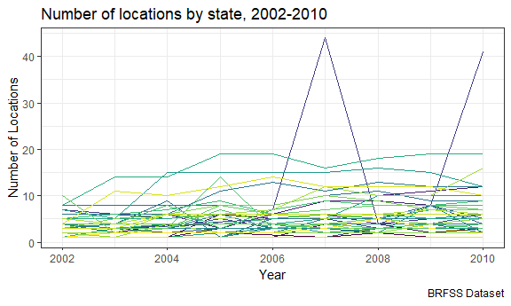
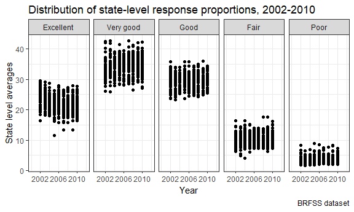

P8103 Homework 3
================
Adina Zhang

Problem 1
---------

#### Set up BRFSS dataset

``` r
# Load and clean BRFSS dataset
brfss_df = brfss_smart2010 %>% 
  janitor::clean_names() %>% 
  filter(topic == "Overall Health") %>% 
  select(year, locationabbr, locationdesc, response, data_value) %>% 
  mutate(response = factor(response,
                           levels = c("Excellent", "Very good", "Good", "Fair", "Poor"))) 

brfss_df
```

    ## # A tibble: 10,625 x 5
    ##     year locationabbr locationdesc          response  data_value
    ##    <int> <chr>        <chr>                 <fct>          <dbl>
    ##  1  2010 AL           AL - Jefferson County Excellent       18.9
    ##  2  2010 AL           AL - Jefferson County Very good       30  
    ##  3  2010 AL           AL - Jefferson County Good            33.1
    ##  4  2010 AL           AL - Jefferson County Fair            12.5
    ##  5  2010 AL           AL - Jefferson County Poor             5.5
    ##  6  2010 AL           AL - Mobile County    Excellent       15.6
    ##  7  2010 AL           AL - Mobile County    Very good       31.3
    ##  8  2010 AL           AL - Mobile County    Good            31.2
    ##  9  2010 AL           AL - Mobile County    Fair            15.5
    ## 10  2010 AL           AL - Mobile County    Poor             6.4
    ## # ... with 10,615 more rows

#### Subset the dataset into number of locations per state in 2002

``` r
# Subset brfss dataset to count number of locations in each state
filter(brfss_df, year == 2002) %>% 
  distinct(locationabbr, locationdesc) %>% 
  group_by(locationabbr) %>% 
  count() %>% 
  filter(n == 7) %>% 
  knitr::kable()
```

| locationabbr |    n|
|:-------------|----:|
| CT           |    7|
| FL           |    7|
| NC           |    7|

In 2002, there were three states (CT, FL, and NC) that observed seven locations.

#### Spaghetti plot

``` r
# Separate dataset into spaghetti plot variables
spaghetti_plot = brfss_df %>% 
  distinct(locationabbr, locationdesc, year) %>% 
  group_by(locationabbr, year) %>% 
  summarize(n = n())

# Create spaghetti_plot 
spaghetti_plot %>% 
  ggplot(aes(x = year, y = n)) +
  geom_line(aes(color = locationabbr)) +
  viridis::scale_color_viridis(
    name = "Location", 
    discrete = TRUE
  ) + 
  labs(
    title = "Number of locations in each state, 2002-2010",
    x = "Year",
    y = "Number of Locations",
    caption = "BRFSS Dataset"
  ) + 
  theme(legend.position = "right")
```



#### Descriptive variables for "Excellent" proportions in 2002, 2006, and 2010

``` r
# Summarize descriptive variables to make a table
brfss_df %>% 
  filter(year %in% c(2002, 2006, 2010), response == "Excellent") %>% 
  group_by(year) %>% 
  summarize(mean_excellent = mean(data_value, na.rm = TRUE),
            std_excellent = sd(data_value, na.rm = TRUE)) %>% 
  knitr::kable()
```

|  year|  mean\_excellent|  std\_excellent|
|-----:|----------------:|---------------:|
|  2002|         23.95806|        4.642574|
|  2006|         22.41068|        4.095734|
|  2010|         21.46890|        4.250867|

#### Five-panel plot, distribution of responses

``` r
# Summarize average proportions of each response 
response_df = brfss_df %>% 
  group_by(year, locationabbr, response) %>% 
  summarize(mean_prop = mean(data_value, na.rm = TRUE))

# Plot distributions in five panels
response_df %>% 
  ggplot(aes(x = year, y = mean_prop)) + 
  geom_point() + 
  facet_grid(.~response) +
  scale_x_continuous(breaks = c(2002, 2006, 2010),
                     limits = c(2000, 2012)) + 
  labs(
    title = "Distribution of state-level average response proportions, 2002-2010",
    x = "Year",
    y = "Average proportion of responses",
    caption = "BRFSS dataset"
  )
```



Problem 2
---------

Problem 3
---------
