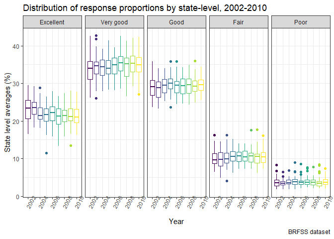
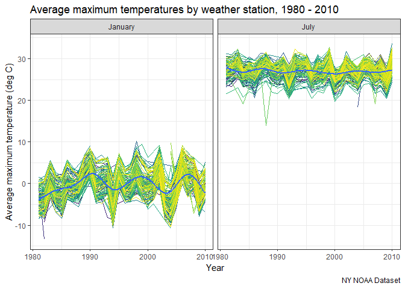
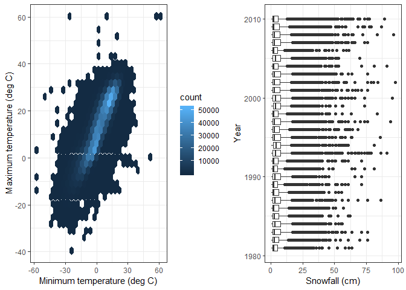

P8103 Homework 3
================
Adina Zhang

Problem 1
---------

#### Set up BRFSS dataset

``` r
# Load and clean BRFSS dataset
brfss_df = brfss_smart2010 %>% 
  janitor::clean_names() %>% 
  filter(topic == "Overall Health") %>% 
  select(year, locationabbr, locationdesc, response, data_value) %>% 
  mutate(response = factor(response,
                           levels = c("Excellent", "Very good", "Good", "Fair", "Poor"))) 

brfss_df
```

    ## # A tibble: 10,625 x 5
    ##     year locationabbr locationdesc          response  data_value
    ##    <int> <chr>        <chr>                 <fct>          <dbl>
    ##  1  2010 AL           AL - Jefferson County Excellent       18.9
    ##  2  2010 AL           AL - Jefferson County Very good       30  
    ##  3  2010 AL           AL - Jefferson County Good            33.1
    ##  4  2010 AL           AL - Jefferson County Fair            12.5
    ##  5  2010 AL           AL - Jefferson County Poor             5.5
    ##  6  2010 AL           AL - Mobile County    Excellent       15.6
    ##  7  2010 AL           AL - Mobile County    Very good       31.3
    ##  8  2010 AL           AL - Mobile County    Good            31.2
    ##  9  2010 AL           AL - Mobile County    Fair            15.5
    ## 10  2010 AL           AL - Mobile County    Poor             6.4
    ## # ... with 10,615 more rows

#### Subset the dataset into number of locations per state in 2002

``` r
# Subset brfss dataset to count number of locations in each state
filter(brfss_df, year == 2002) %>% 
  distinct(locationabbr, locationdesc) %>% 
  group_by(locationabbr) %>% 
  count() %>% 
  filter(n == 7) %>% 
  knitr::kable()
```

| locationabbr |    n|
|:-------------|----:|
| CT           |    7|
| FL           |    7|
| NC           |    7|

In 2002, there were three states (CT, FL, and NC) that observed seven locations.

#### Spaghetti plot

``` r
# Separate dataset into spaghetti plot variables
spaghetti_plot = brfss_df %>% 
  distinct(locationabbr, locationdesc, year) %>% 
  group_by(locationabbr, year) %>% 
  summarize(n = n())

# Create spaghetti_plot 
spaghetti_plot %>% 
  ggplot(aes(x = year, y = n)) +
  geom_line(aes(color = locationabbr)) +
  viridis::scale_color_viridis(
    name = "Location", 
    discrete = TRUE
  ) + 
  labs(
    title = "Number of locations by state, 2002-2010",
    x = "Year",
    y = "Number of Locations",
    caption = "BRFSS Dataset"
  ) + 
  theme(legend.position = "none")
```


#### Descriptive variables for "Excellent" proportions in 2002, 2006, and 2010

``` r
# Summarize descriptive variables to make a table
brfss_df %>% 
  filter(year %in% c(2002, 2006, 2010), response == "Excellent") %>% 
  group_by(year) %>% 
  summarize(mean_excellent = mean(data_value, na.rm = TRUE),
            std_excellent = sd(data_value, na.rm = TRUE)) %>% 
  knitr::kable()
```

|  year|  mean\_excellent|  std\_excellent|
|-----:|----------------:|---------------:|
|  2002|         23.95806|        4.642574|
|  2006|         22.41068|        4.095734|
|  2010|         21.46890|        4.250867|

#### Five-panel plot, distribution of responses

``` r
# Summarize average proportions of each response 
response_df = brfss_df %>% 
  group_by(year, locationabbr, response) %>% 
  summarize(mean_prop = mean(data_value, na.rm = TRUE))

# Plot distributions in five panels
response_df %>% 
  ggplot(aes(x = year, y = mean_prop)) + 
  geom_line(aes(color = locationabbr)) + 
  facet_grid(.~response) + 
  labs(
    title = "Distribution of response proportions by state-level, 2002-2010",
    x = "Year",
    y = "State level averages",
    caption = "BRFSS dataset"
  ) + 
  viridis::scale_color_viridis(
    name = "Location", 
    discrete = TRUE
  ) + 
  theme(legend.position = "none",
        axis.text.x = element_text(angle = 60))
```



Problem 2
---------

#### Instacart summary

``` r
# Load instacard
instacart_df = instacart

instacart_df
```

    ## # A tibble: 1,384,617 x 15
    ##    order_id product_id add_to_cart_ord~ reordered user_id eval_set
    ##       <int>      <int>            <int>     <int>   <int> <chr>   
    ##  1        1      49302                1         1  112108 train   
    ##  2        1      11109                2         1  112108 train   
    ##  3        1      10246                3         0  112108 train   
    ##  4        1      49683                4         0  112108 train   
    ##  5        1      43633                5         1  112108 train   
    ##  6        1      13176                6         0  112108 train   
    ##  7        1      47209                7         0  112108 train   
    ##  8        1      22035                8         1  112108 train   
    ##  9       36      39612                1         0   79431 train   
    ## 10       36      19660                2         1   79431 train   
    ## # ... with 1,384,607 more rows, and 9 more variables: order_number <int>,
    ## #   order_dow <int>, order_hour_of_day <int>,
    ## #   days_since_prior_order <int>, product_name <chr>, aisle_id <int>,
    ## #   department_id <int>, aisle <chr>, department <chr>

Instacart is an online grocery shopping company, and the instacard dataset contains information on online grocery orders from their customers. The instacart dataset includes 1384617 observations and 15 variables. Some of these key variables include product name, food aisle information (name, number, department), time or order (day of the week, hour of the day, days since last ordered). For example, there are 21 departments which range from snacks, frozen foods, to dairy and eggs...

#### Aisle information

There are 134 aisles in this dataset. Some examples of these include yogurt, fresh vegetables, and specialty cheeses. The aisle with the most counts of order. Most items are ordered from the fresh vegetable, fresh fruit, and packaged vegetables and fruits aisles.

``` r
# Group by aisles and summarize counts
aisle_count = instacart_df %>% 
  group_by(aisle, department) %>% 
  summarize(n = n()) %>% 
  arrange(desc(n)) 
  
aisle_count
```

    ## # A tibble: 134 x 3
    ## # Groups:   aisle [134]
    ##    aisle                         department      n
    ##    <chr>                         <chr>       <int>
    ##  1 fresh vegetables              produce    150609
    ##  2 fresh fruits                  produce    150473
    ##  3 packaged vegetables fruits    produce     78493
    ##  4 yogurt                        dairy eggs  55240
    ##  5 packaged cheese               dairy eggs  41699
    ##  6 water seltzer sparkling water beverages   36617
    ##  7 milk                          dairy eggs  32644
    ##  8 chips pretzels                snacks      31269
    ##  9 soy lactosefree               dairy eggs  26240
    ## 10 bread                         bakery      23635
    ## # ... with 124 more rows

**Aisle Count Plot**

``` r
# Plot distribution of items ordered from each aisle
ggplot(aisle_count, aes(x = log(n), y = aisle)) +
  geom_point(aes(color = department)) + 
  facet_grid(rows = vars(department), scales = "free", space = "free") + 
  labs(
    title = "Number of items ordered by aisle",
    x = "Number of items ordered (log(n))",
    y = "Aisle name"
  ) + 
  theme(axis.ticks = element_blank(), 
        legend.position = "none",
        axis.text.y = element_text(size = 7)) 
```


#### Popular aisle items

``` r
# Subset and group instacart_df to products of interest
# Count products and then rank them to see most popular purchases
instacart_df %>% 
  filter(aisle %in% c("baking ingredients", 
                      "dog food care", 
                      "packaged vegetables fruits")) %>% 
  group_by(aisle, product_name) %>% 
  summarize(n = n()) %>% 
  mutate(product_rank = min_rank(desc(n))) %>% 
  filter(product_rank == 1) %>% 
  knitr::kable()
```

| aisle                      | product\_name                                 |     n|  product\_rank|
|:---------------------------|:----------------------------------------------|-----:|--------------:|
| baking ingredients         | Light Brown Sugar                             |   499|              1|
| dog food care              | Snack Sticks Chicken & Rice Recipe Dog Treats |    30|              1|
| packaged vegetables fruits | Organic Baby Spinach                          |  9784|              1|

#### Average time of day

``` r
# Subset instacart data to products of interest and times
# Summarize average hour of the day and spread dataset into table format
instacart_df %>% 
  filter(product_name %in% c("Pink Lady Apples", "Coffee Ice Cream")) %>% 
  select(product_name, order_hour_of_day, order_dow) %>% 
  group_by(order_dow, product_name) %>% 
  summarize(mean_hour = mean(order_hour_of_day, na.rm = TRUE)) %>% 
  spread(key = product_name, value = mean_hour) %>% 
  knitr::kable()
```

|  order\_dow|  Coffee Ice Cream|  Pink Lady Apples|
|-----------:|-----------------:|-----------------:|
|           0|          13.77419|          13.44118|
|           1|          14.31579|          11.36000|
|           2|          15.38095|          11.70213|
|           3|          15.31818|          14.25000|
|           4|          15.21739|          11.55172|
|           5|          12.26316|          12.78431|
|           6|          13.83333|          11.93750|

This table depicts the average time of day (Sunday through Saturday) customers ordered coffee ice cream and pink lady apples. Note that the week days begin with Sunday (0) and progress to Saturday (6). Based off of this table, people usual buy coffee ice cream in the afternoons with the earliest average time at 12.26 hours on Friday and the latest average time at 15.38 hours on Tuesday. People usually buy Pink Lady Apples at mid-day with the earliest average time at 11.36 hours on Monday and the latest average time at 14.25 hours on Wednesday.

Problem 3
---------

#### NY NOAA Summary

``` r
# Load NY NOAA Summary and clean
ny_noaa_df = ny_noaa %>% 
  separate(date, into = c("year", "month", "day"), sep = "-") %>% 
  mutate(year = as.integer(year),
         month = as.integer(month),
         day = as.integer(day),
         tmax = as.integer(tmax)/10,
         tmin = as.integer(tmin)/10)

ny_noaa_df
```

    ## # A tibble: 2,595,176 x 9
    ##    id           year month   day  prcp  snow  snwd  tmax  tmin
    ##    <chr>       <int> <int> <int> <int> <int> <int> <dbl> <dbl>
    ##  1 US1NYAB0001  2007    11     1    NA    NA    NA    NA    NA
    ##  2 US1NYAB0001  2007    11     2    NA    NA    NA    NA    NA
    ##  3 US1NYAB0001  2007    11     3    NA    NA    NA    NA    NA
    ##  4 US1NYAB0001  2007    11     4    NA    NA    NA    NA    NA
    ##  5 US1NYAB0001  2007    11     5    NA    NA    NA    NA    NA
    ##  6 US1NYAB0001  2007    11     6    NA    NA    NA    NA    NA
    ##  7 US1NYAB0001  2007    11     7    NA    NA    NA    NA    NA
    ##  8 US1NYAB0001  2007    11     8    NA    NA    NA    NA    NA
    ##  9 US1NYAB0001  2007    11     9    NA    NA    NA    NA    NA
    ## 10 US1NYAB0001  2007    11    10    NA    NA    NA    NA    NA
    ## # ... with 2,595,166 more rows

In this dataset, r length((rowSums(is.na(ny\_noaa\_df))))/nrow(ny\_noaa\_df)\` of observations have missing variables.

#### Maximum temperature

``` r
tmax_plot = ny_noaa_df %>%
  filter(month %in% c(1, 7), !(is.na(tmax))) %>% 
  group_by(id, year, month) %>% 
  summarize(mean_max_temp = mean(tmax, na.rm = TRUE))

tmax_plot %>% 
  ggplot(aes(x = year, y = mean_max_temp)) + 
  geom_line(aes(color = id)) + 
  geom_smooth(se = FALSE) + 
  facet_grid(.~month) + 
  theme(legend.position = "none") + 
  viridis::scale_color_viridis(
    name = "Location", 
    discrete = TRUE
  ) + 
  labs(
    title = "Average weather station maximum temperatures in January and July, 1980 - 2010",
    x = "Year",
    y = "Average maximum temperature (deg C)",
    caption = "NY NOAA Dataset"
  )
```



#### Two panel temperature and snowfall plots

``` r
# Create a hexplot to compare tmin and tmax
noaa_hexplot = ny_noaa_df %>% 
  ggplot(aes(x = tmin, y = tmax)) +
  geom_hex() + 
  labs(
    x = "Minimum temperature (deg C)",
    y = "Maximum temperature (deg C)"
  )

# Create a barplot of snowfall by year
noaa_barplot = ny_noaa_df %>% 
  filter(snow > 0 & snow < 100) %>% 
  ggplot(aes(x = year, y = snow)) + 
  geom_boxplot(aes(group = year)) + 
  coord_flip() + 
  labs(
    x = "Year",
    y = "Snowfall (mm)"
    )

noaa_hexplot + noaa_barplot
```

    ## Warning: Removed 1136276 rows containing non-finite values (stat_binhex).


