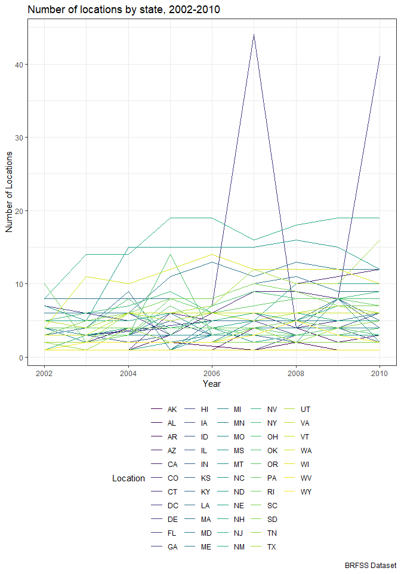
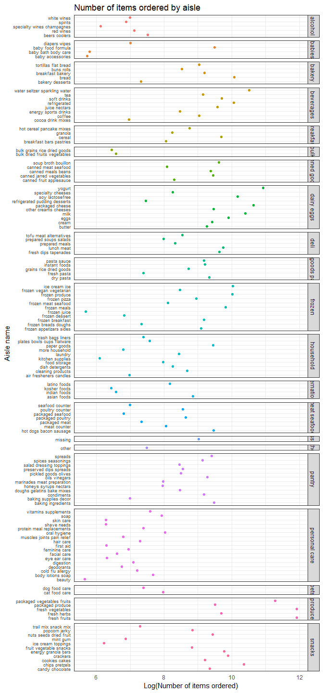

P8103 Homework 3
================
Adina Zhang

Problem 1
---------

#### Set up BRFSS dataset

``` r
# Load and clean BRFSS dataset
brfss_df = brfss_smart2010 %>% 
  janitor::clean_names() %>% 
  filter(topic == "Overall Health") %>% 
  select(year, locationabbr, locationdesc, response, data_value) %>% 
  mutate(response = factor(response,
                           levels = c("Excellent", "Very good", "Good", "Fair", "Poor"))) 

brfss_df
```

    ## # A tibble: 10,625 x 5
    ##     year locationabbr locationdesc          response  data_value
    ##    <int> <chr>        <chr>                 <fct>          <dbl>
    ##  1  2010 AL           AL - Jefferson County Excellent       18.9
    ##  2  2010 AL           AL - Jefferson County Very good       30  
    ##  3  2010 AL           AL - Jefferson County Good            33.1
    ##  4  2010 AL           AL - Jefferson County Fair            12.5
    ##  5  2010 AL           AL - Jefferson County Poor             5.5
    ##  6  2010 AL           AL - Mobile County    Excellent       15.6
    ##  7  2010 AL           AL - Mobile County    Very good       31.3
    ##  8  2010 AL           AL - Mobile County    Good            31.2
    ##  9  2010 AL           AL - Mobile County    Fair            15.5
    ## 10  2010 AL           AL - Mobile County    Poor             6.4
    ## # ... with 10,615 more rows

#### Subset the dataset into number of locations per state in 2002

``` r
# Subset brfss dataset to count number of locations in each state
filter(brfss_df, year == 2002) %>% 
  distinct(locationabbr, locationdesc) %>% 
  group_by(locationabbr) %>% 
  count() %>% 
  filter(n == 7) %>% 
  knitr::kable()
```

| locationabbr |    n|
|:-------------|----:|
| CT           |    7|
| FL           |    7|
| NC           |    7|

In 2002, there were three states (CT, FL, and NC) that observed seven locations.

#### Spaghetti plot

``` r
# Separate dataset into spaghetti plot variables
spaghetti_plot = brfss_df %>% 
  distinct(locationabbr, locationdesc, year) %>% 
  group_by(locationabbr, year) %>% 
  summarize(n = n())

# Create spaghetti_plot 
spaghetti_plot %>% 
  ggplot(aes(x = year, y = n)) +
  geom_line(aes(color = locationabbr)) +
  viridis::scale_color_viridis(
    name = "Location", 
    discrete = TRUE
  ) + 
  labs(
    title = "Number of locations in each state, 2002-2010",
    x = "Year",
    y = "Number of Locations",
    caption = "BRFSS Dataset"
  ) + 
  theme(legend.position = "right")
```



#### Descriptive variables for "Excellent" proportions in 2002, 2006, and 2010

``` r
# Summarize descriptive variables to make a table
brfss_df %>% 
  filter(year %in% c(2002, 2006, 2010), response == "Excellent") %>% 
  group_by(year) %>% 
  summarize(mean_excellent = mean(data_value, na.rm = TRUE),
            std_excellent = sd(data_value, na.rm = TRUE)) %>% 
  knitr::kable()
```

|  year|  mean\_excellent|  std\_excellent|
|-----:|----------------:|---------------:|
|  2002|         23.95806|        4.642574|
|  2006|         22.41068|        4.095734|
|  2010|         21.46890|        4.250867|

#### Five-panel plot, distribution of responses

``` r
# Summarize average proportions of each response 
response_df = brfss_df %>% 
  group_by(year, locationabbr, response) %>% 
  summarize(mean_prop = mean(data_value, na.rm = TRUE))

# Plot distributions in five panels
response_df %>% 
  ggplot(aes(x = year, y = mean_prop)) + 
  geom_point() + 
  facet_grid(.~response) +
  scale_x_continuous(breaks = c(2002, 2006, 2010),
                     limits = c(2000, 2012)) + 
  labs(
    title = "Distribution of state-level response proportions, 2002-2010",
    x = "Year",
    y = "State level averages",
    caption = "BRFSS dataset"
  )
```


Problem 2
---------

#### Instacart summary

``` r
# Load instacard
instacart_df = instacart

instacart_df
```

    ## # A tibble: 1,384,617 x 15
    ##    order_id product_id add_to_cart_ord~ reordered user_id eval_set
    ##       <int>      <int>            <int>     <int>   <int> <chr>   
    ##  1        1      49302                1         1  112108 train   
    ##  2        1      11109                2         1  112108 train   
    ##  3        1      10246                3         0  112108 train   
    ##  4        1      49683                4         0  112108 train   
    ##  5        1      43633                5         1  112108 train   
    ##  6        1      13176                6         0  112108 train   
    ##  7        1      47209                7         0  112108 train   
    ##  8        1      22035                8         1  112108 train   
    ##  9       36      39612                1         0   79431 train   
    ## 10       36      19660                2         1   79431 train   
    ## # ... with 1,384,607 more rows, and 9 more variables: order_number <int>,
    ## #   order_dow <int>, order_hour_of_day <int>,
    ## #   days_since_prior_order <int>, product_name <chr>, aisle_id <int>,
    ## #   department_id <int>, aisle <chr>, department <chr>

Instacart is an online grocery shopping company, and the instacard dataset contains information on online grocery orders from their customers. The instacart dataset includes 1384617 observations and 15 variables. Some of these key variables include product name, food aisle information (name, number, department), time or order (day of the week, hour of the day, days since last ordered). For example, there are 21 departments which range from snacks, frozen foods, to dairy and eggs...

#### Aisle information

There are 134 aisles in this dataset. Some examples of these include yogurt, fresh vegetables, and specialty cheeses. The aisle with the most counts of order. Most items are ordered from the fresh vegetable, fresh fruit, and packaged vegetables and fruits aisles.

``` r
# Group by aisles and summarize counts
aisle_count = instacart_df %>% 
  group_by(aisle) %>% 
  summarize(n = n()) %>% 
  arrange(desc(n)) 
  
aisle_count
```

    ## # A tibble: 134 x 2
    ##    aisle                              n
    ##    <chr>                          <int>
    ##  1 fresh vegetables              150609
    ##  2 fresh fruits                  150473
    ##  3 packaged vegetables fruits     78493
    ##  4 yogurt                         55240
    ##  5 packaged cheese                41699
    ##  6 water seltzer sparkling water  36617
    ##  7 milk                           32644
    ##  8 chips pretzels                 31269
    ##  9 soy lactosefree                26240
    ## 10 bread                          23635
    ## # ... with 124 more rows

``` r
# Plot distribution of items ordered from each aisle
ggplot(aisle_count, aes(x = reorder(aisle, order(n, decreasing = TRUE)), y = n)) +
  geom_bar(stat = "identity") + 
  labs(
    title = "Number of items ordered from each aisle",
    x = "Aisle Names",
    y = "N",
    caption = "Instacart Data"
  ) + 
  theme(axis.ticks = element_blank(), 
        legend.position = "none",
        axis.text.x = element_text(size = 3, angle = 290))
```



Problem 3
---------
